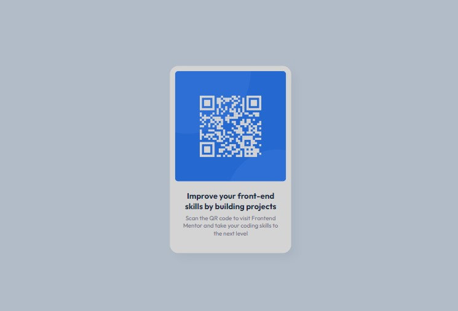

# QR Code Component Solution

This is a solution to the [QR code component challenge on Frontend Mentor](https://www.frontendmentor.io/challenges/qr-code-component-iux_sIO_H). Frontend Mentor challenges help you improve your coding skills by building realistic projects. 

## Table of Contents

- [Overview](#overview)
  - [Screenshot](#screenshot)
  - [Links](#links)
- [My Process](#my-process)
  - [Built With](#built-with)
  - [What I Learned](#what-i-learned)
- [Author](#author)
- [Acknowledgments](#acknowledgments)

## Overview

### Screenshot

### Links

- [Solution URL](https://github.com/jvodlz/qr-code-component)
- [Live Site](https://jvodlz.github.io/qr-code-component)

## My Process

1. Look at the design to plan how to begin and best sequence to tackle the task
2. Write the HTML
3. Write the CSS based on style guide information
4. Continue to make adjustments to create a design that most resembles the original design

### Built With

- Semantic HTML5 markup
- CSS custom properties
- Flexbox

### What I Learned

- Embedding fonts using @import
- More CSS conventions and properties

## Author

- Frontend Mentor - [@jvodlz](https://www.frontendmentor.io/profile/jvodlz)

## Acknowledgments

Inspiration by [Frontend Mentor](https://www.frontendmentor.io/)